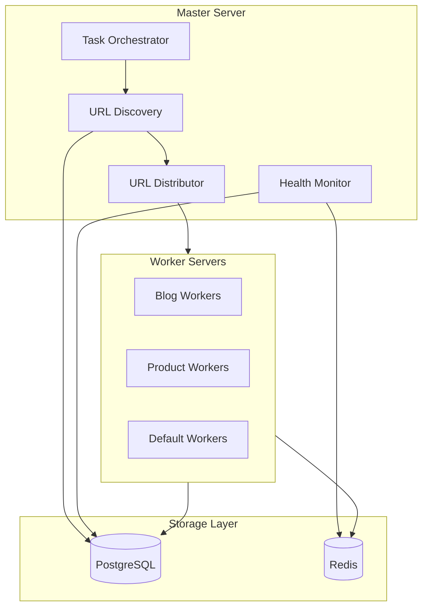
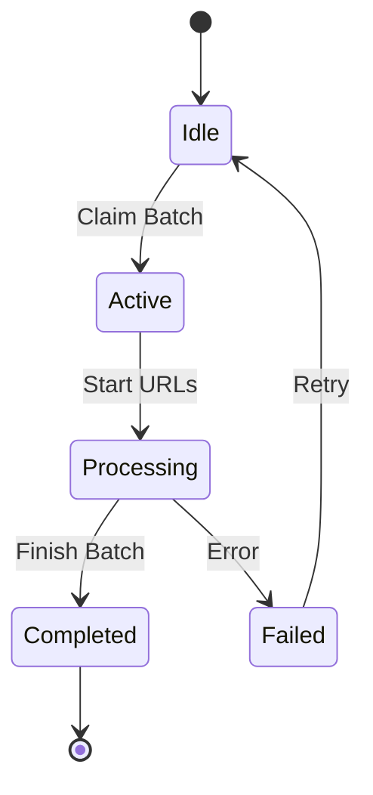
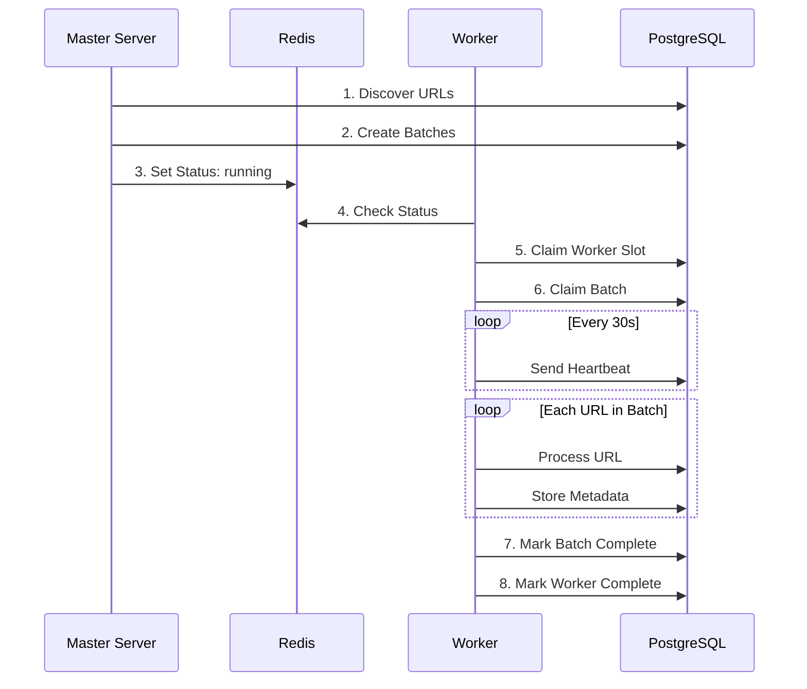
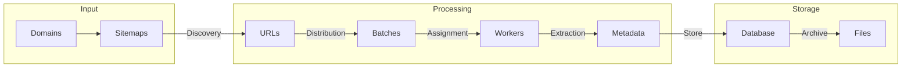
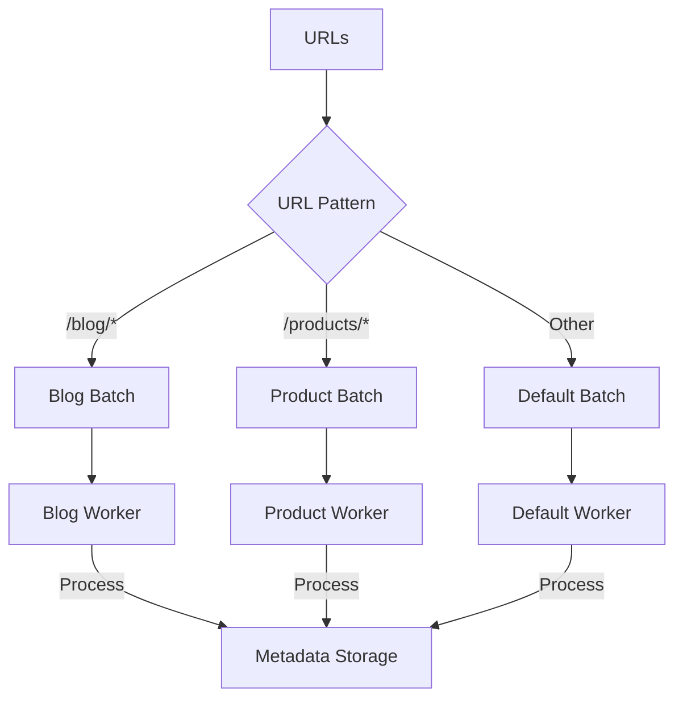

# System Architecture Diagrams

## Component Architecture

```mermaid
graph TB
    subgraph Master["Master Server"]
        TaskOrch["Task Orchestrator"]
        URLDisc["URL Discovery"]
        URLDist["URL Distributor"]
        Health["Health Monitor"]
    end

    subgraph Storage["Storage Layer"]
        DB[(PostgreSQL)]
        RC[(Redis)]
    end

    subgraph Workers["Worker Servers"]
        BW["Blog Workers"]
        PW["Product Workers"]
        DW["Default Workers"]
    end

    TaskOrch --> URLDisc
    URLDisc --> DB
    URLDisc --> URLDist
    URLDist --> Workers
    Workers --> DB
    Workers --> RC
    Health --> RC
    Health --> DB
```

## Worker Lifecycle

```mermaid
stateDiagram-v2
    [*] --> Idle
    Idle --> Active: Claim Batch
    Active --> Processing: Start URLs
    Processing --> Completed: Finish Batch
    Processing --> Failed: Error
    Failed --> Idle: Retry
    Completed --> [*]
```

## URL Processing Flow

```mermaid
sequenceDiagram
    participant M as Master Server
    participant R as Redis
    participant W as Worker
    participant DB as PostgreSQL
    
    M->>DB: 1. Discover URLs
    M->>DB: 2. Create Batches
    M->>R: 3. Set Status: running
    W->>R: 4. Check Status
    W->>DB: 5. Claim Worker Slot
    W->>DB: 6. Claim Batch
    loop Every 30s
        W->>DB: Send Heartbeat
    end
    loop Each URL in Batch
        W->>DB: Process URL
        W->>DB: Store Metadata
    end
    W->>DB: 7. Mark Batch Complete
    W->>DB: 8. Mark Worker Complete
```

## Data Flow

```mermaid
flowchart LR
    subgraph Input
        Domains-->Sitemaps
    end
    
    subgraph Processing
        Sitemaps-->|Discovery| URLs
        URLs-->|Distribution| Batches
        Batches-->|Assignment| Workers
        Workers-->|Extraction| Metadata
    end
    
    subgraph Storage
        Metadata-->|Store| Database
        Database-->|Archive| Files
    end
```

## Batch Distribution

```mermaid
graph TD
    URLs[URLs] --> Pattern{URL Pattern}
    Pattern -->|/blog/*| BlogBatch[Blog Batch]
    Pattern -->|/products/*| ProductBatch[Product Batch]
    Pattern -->|Other| DefaultBatch[Default Batch]
    
    BlogBatch --> BlogWorker[Blog Worker]
    ProductBatch --> ProductWorker[Product Worker]
    DefaultBatch --> DefaultWorker[Default Worker]
    
    BlogWorker --> |Process| Metadata[Metadata Storage]
    ProductWorker --> |Process| Metadata
    DefaultWorker --> |Process| Metadata
``` 